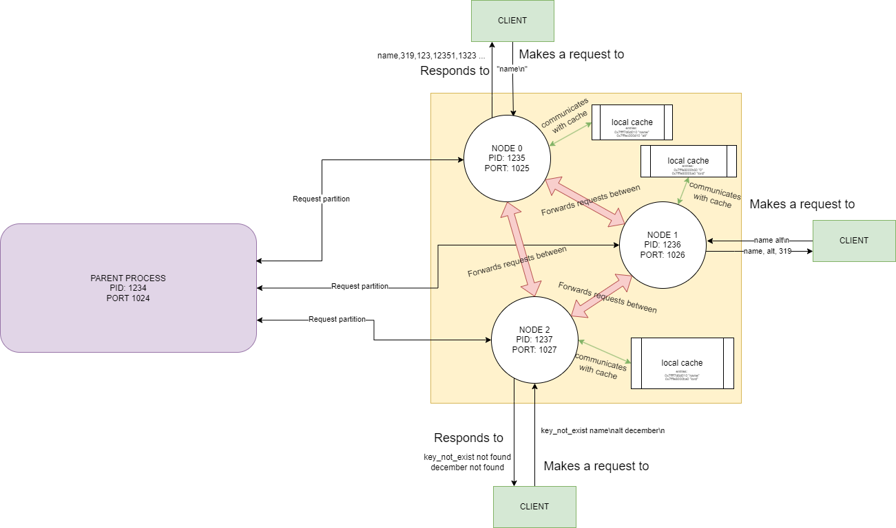
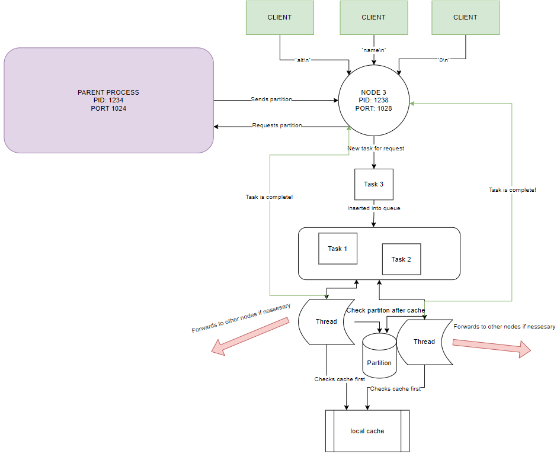

# Report

## High-Level Overview

The primary focus of this server is to serve as a distributed key-value store. It runs multiple nodes and is capable of handling a variety of queries like fetching and intersecting values based on keys. Here, we will focus on how a single node operates within this architecture.

Each node operates independently, running its server loop, which listens for incoming connections and queues them for execution in a thread pool. The node first initiates by setting up its cache, requesting its partition of the database (digest phase), and then transitions into the serve phase, where it awaits client requests.

When a request arrives, it first lands in a thread pool, where it awaits processing by the next available worker thread. Before executing any database operations, the node checks its local cache for the requested key. If the key is found in the cache, the corresponding value is promptly returned. If the key is not in the cache, the node searches its partition of the database. Should the key be found in the partition, its value is not only returned but also added to the cache for future quicker access. If the key is not in the local partition, the node forwards the request to the appropriate node. Once the value is retrieved from the other node, it is cached locally before being returned to the client.

## Additional Features

### Multiple Nodes and Forwarding

The architecture is designed to support a cluster of nodes, facilitating scalability and high availability. Each node runs as a separate child process, orchestrated by a master process that handles the initialization and teardown. When a node receives a request for a key that it does not own, it automatically forwards the request to the node responsible for that particular key partition.

### Multiple Threads

To maximize concurrency and resource utilization, each node employs a thread pool architecture. When the node's server loop receives an incoming request, it queues the request into a shared task queue. Worker threads from the thread pool continuously poll this queue, executing tasks as they come in.

### Caching and Node Forwarding

To expedite data retrieval, each node maintains a local cache utilizing the Least Recently Used (LRU) eviction algorithm. When a request arrives, the node first checks this cache before querying its local database partition. If the data is found in the cache, it is returned immediately. If the data is not in the cache but exists in the local partition, it is fetched, returned, and subsequently added to the cache. When a node forwards a request to another node and receives a response, this data is also cached locally.

## Important Design Decisions

### Caching

I chose to implement a Least Recently Used (LRU) caching algorithm over other eviction methods such as First-In-First-Out (FIFO) or random eviction, primarily for its versatility and efficiency across diverse workloads. LRU excels in scenarios where temporal locality is prevalent, a characteristic commonly found in database access patterns. In our key-value store, repeated queries for the same key are likely, making LRU particularly suitable. By evicting the least recently used items first, the cache maintains a set of data that is most likely to be accessed in the near future, thereby increasing cache hits and reducing latency. Furthermore, LRU's simplicity allows for easy implementation and maintenance, while still providing robust performance gains.

### Multithreading

The use of a thread pool instead of creating a new thread for each incoming request significantly lowers the overhead and increases the speed at which requests can be processed.

### Request Parsing

To deal with multi-line client requests, special attention was paid to request parsing. Initial implementation lacked a clear termination for forwarded requests. This was solved by checking for a null-terminator and the closest '\n' before it, trimming the characters in between to achieve explicit termination.

## Observations and Implementation Challenges

### Request Parsing

One of the first challenges was with parsing multi-line client requests. The issue was with the lack of explicit termination in the requests. This was resolved by introducing checks for null terminators and the nearest newline characters, trimming irrelevant characters.

### Caching Strategy

Choosing an eviction strategy for the cache was another challenge. After some consideration, the LRU algorithm was chosen due to its benefits (explained above).

### Concurrency

Implementing multi-threading also posed some synchronization challenges. However, employing a thread pool simplified the execution model, making it more manageable.

### Unresolved Issues

Some tests did fail during the testing phase, indicating a segmentation fault. Unfortunately, the issue could not be resolved as debugging this particular problem proved difficult. I was unable to replicate the mass requests the test files were sending, making it challenging to identify the root cause of the segmentation fault.

The project was extensively tested to validate these features and design decisions, with both encouraging and some inconclusive results. Overall, the server architecture has proven to be robust, efficient, and scalable, albeit with some areas requiring further investigation.

This project serves as a comprehensive example of a multithreaded, distributed key-value store with optimized data retrieval through caching. It has been designed with scalability and high availability in mind, using modern techniques like multithreading and node forwarding to achieve these goals.

